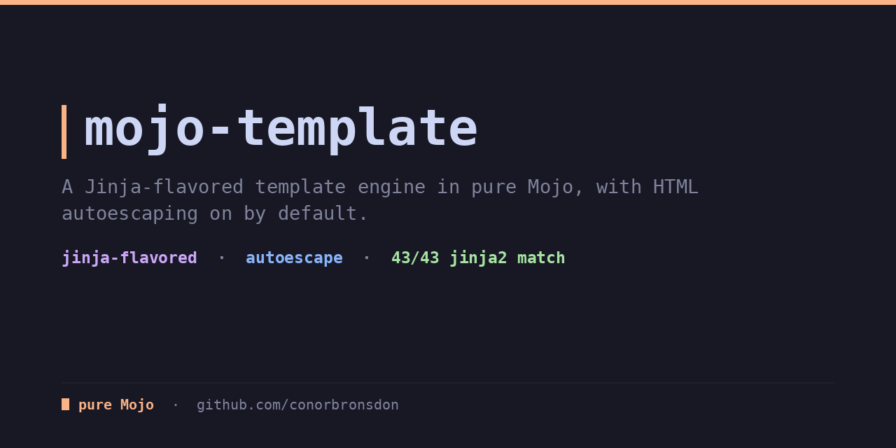
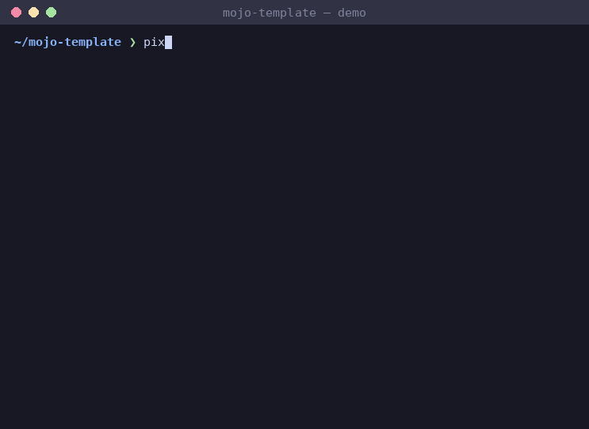

<div align="center">

# mojo-template

**A Jinja-flavored template engine in pure Mojo, verified byte-for-byte against Jinja2. No Python dependencies, no FFI.**

[](LICENSE)
[](https://mojolang.org)
[](https://chainofthought.show)
[](https://x.com/ConorBronsdon)




</div>

As of mid-2026 the only Mojo template engine is embedded inside the
[flare](https://github.com/saviorand/lightbug_http) networking/web
framework, useful if you're already in flare, but not usable on its own.
mojo-template is complementary and standalone: no framework, no server,
no dependencies beyond the Mojo stdlib. Turn a template string plus a data
context into a rendered string, with HTML autoescaping on by default, the
familiar [Jinja](https://jinja.palletsprojects.com/) `{{ }}` / ``
syntax, and output verified byte-for-byte against Jinja2 on the supported
subset. Whether you're generating an email body, an HTML fragment, a
config file, or a code-gen artifact: if you're building on flare, use its
built-in engine; if you just need templating as a building block, use
this.

```mojo
from template import render, TemplateValue, Context

var ctx = Context()
ctx["name"] = TemplateValue("Conor & Kate")
ctx["items"] = TemplateValue.list(
    [TemplateValue("apple"), TemplateValue("banana")]
)

print(render("Hi {{ name }}, {{ items | length }} items", ctx))
# Hi Conor &amp; Kate, 2 items
```

Escaping is automatic (`&` became `&amp;` above); opt out per value with
`{{ x | safe }}`.

### Coming from Python

The template syntax is Jinja-flavored, so `{{ name }}`, ``,
``, filters like `{{ v | default('x') }}` and `{{ items | length }}`,
and `loop.index` all read the same as in `jinja2`. What differs is how you
build the render context: instead of passing Python kwargs, you build a
`Context` (a `Dict[String, TemplateValue]`) explicitly.

Python (`jinja2`):

```python
from jinja2 import Template
Template("Hi {{ name }}").render(name="Conor")
```

mojo-template:

```mojo
from template import render, Context, TemplateValue

var ctx = Context()
ctx["name"] = TemplateValue("Conor")
print(render("Hi {{ name }}", ctx))
```

Build nested values with `TemplateValue.dict([keys], [values])` and
`TemplateValue.list([...])`. `parse_template(source)` returns a reusable
`Template` if you want to render the same source repeatedly.

## What it handles

**Output**: `{{ expr }}`, HTML-escaped by default; `{{ expr | safe }}`
emits raw.

**Expressions**

- variables, dotted access `a.b.c`, index access `a[0]`, `a["k"]`
- literals: strings, ints, floats, `true` / `false` / `none`
- comparisons: `==` `!=` `<` `>` `<=` `>=`
- boolean logic: `and`, `or` (both return the deciding operand, like
  Jinja), `not`
- arithmetic: `+` `-` (and `+` concatenates two strings)
- filter pipe: `expr | name` / `name(args)`, chainable

**Filters (13)**: `upper`, `lower`, `title`, `trim`, `length`, `default(x)`,
`join(sep)`, `escape`, `safe`, `truncate(n)`, `replace(a, b)`, `first`,
`last`. An unknown filter is an error.

**Blocks**

- `` / `` / `` / ``
- `` … `` with `loop.index`, `loop.index0`,
  `loop.first`, `loop.last`, `loop.length`, `loop.revindex`,
  `loop.revindex0`
- ``
- `{# comments #}`
- whitespace-control trim markers: ``, `{{- … -}}`

**The value model**: a `TemplateValue` is a recursive value, a scalar
(none / bool / int / float / string) or a container (list / dict of
`TemplateValue`s). Because a struct cannot contain itself by value in
Mojo (a self-referential field is not implicitly destructible), each
`TemplateValue` stores its tree as a flat index-arena, the same pattern
mojo-markdown's `BlockTree` uses. You build them with constructors and
factories:

```mojo
TemplateValue("text")                       # string (also Int / Float64 / Bool)
TemplateValue.none()
TemplateValue.list([TemplateValue(1), TemplateValue(2)])
TemplateValue.dict(["k"], [TemplateValue("v")])
```

`Context` is just `Dict[String, TemplateValue]`.

**Error behavior**: syntax errors (unclosed tags, unknown filters,
malformed expressions, mismatched block tags) `raise` with a line number,
computed lazily on the error path so the happy path pays nothing.
Following the strict-mode location pattern from
[mojo-feed](https://github.com/conorbronsdon/mojo-feed). Rendering a
variable / attribute / index that doesn't exist is an error too (stricter
than Jinja's default, which emits an empty string): the `default` filter
still catches missing values, so `{{ missing | default('x') }}` works,
since undefined is falsy and `default`-catchable even though rendering it
directly raises.

**Security**: output is HTML-escaped by default (MarkupSafe/Jinja rules:
`& < > ' "`); no code-execution surface, since expressions are a fixed
grammar, not embedded Mojo or Python; no file or network I/O in the
render path; recursion/nesting depth is capped at 256, matching sibling
libraries.

## What it deliberately does NOT do

Deliberately deferred (documented, not hidden):

- **Template inheritance**: `` / ``.
- **Includes**: ``.
- **Macros**: `` / ``.
- **Custom / user-registered filters.**

## Install

With [pixi](https://pixi.prefix.dev):

```bash
pixi install
pixi run test
```

Or with uv:

```bash
uv venv
uv pip install mojo --index https://whl.modular.com/nightly/simple/ --prerelease allow
.venv/bin/mojo run -I src test/test_template.mojo
```

Requires a Mojo nightly (`>=1.0.0b3`).

## Usage

```mojo
render(template_source: String, context: Context) raises -> String
```

See `examples/render_email.mojo` for a full worked example (an HTML email
body built from a nested context with a loop and a conditional).

## Tests

```bash
pixi run test    # 59 tests: per-feature + Jinja2 fixture parity
pixi run demo    # render the example email
pixi run fuzz "{{ x }}"
```

59 tests total, all green, plus Jinja2 byte-compatibility: Jinja2's
escaping and whitespace defaults (`autoescape=True`) are the spec.
`test/data/gen_fixtures.py` renders 43 templates against a shared context
with Jinja2 and writes the outputs to `test/data/fixtures/manifest.txt`;
the Mojo test suite (`test_jinja2_fixture_parity`) reproduces all 43
byte-for-byte. Byte-compatibility covers the supported subset only:
directly printing a list/dict (rather than iterating it) uses a
best-effort Python-style repr and is not byte-guaranteed, so templates
iterate containers instead. Regenerate the fixtures after installing
Jinja2 into the venv:

```bash
uv pip install jinja2
.venv/bin/python test/data/gen_fixtures.py
```

Fuzz target runs clean on malformed input.

## Part of a pure-Mojo library suite

Eleven pure-Mojo libraries that mirror familiar Python stdlib and PyPI APIs,
filling gaps in the native Mojo ecosystem:

- [mojo-xml](https://github.com/conorbronsdon/mojo-xml) — general-purpose XML
  parsing, an ElementTree-shaped DOM (Python's `xml.etree.ElementTree`)
- [mojo-feed](https://github.com/conorbronsdon/mojo-feed) — RSS, Atom, and
  JSON Feed parsing (Python's `feedparser`)
- [mojo-captions](https://github.com/conorbronsdon/mojo-captions) — SRT and
  WebVTT subtitle/transcript parsing (no Python stdlib parallel)
- [mojo-html](https://github.com/conorbronsdon/mojo-html) — HTML parsing and
  article extraction (Python's readability)
- [mojo-markdown](https://github.com/conorbronsdon/mojo-markdown) —
  CommonMark markdown parsing (Python's `markdown`)
- [mojo-unicodedata](https://github.com/conorbronsdon/mojo-unicodedata) —
  Unicode normalization and case folding (Python's `unicodedata`)
- [mojo-diff](https://github.com/conorbronsdon/mojo-diff) — text diffing
  (Python's `difflib`)
- [mojo-tar](https://github.com/conorbronsdon/mojo-tar) — tar archive
  reading and writing (Python's `tarfile`)
- [mojo-redis](https://github.com/conorbronsdon/mojo-redis) — a Redis
  client (Python's `redis-py`)
- [mojo-url](https://github.com/conorbronsdon/mojo-url) — URL parsing
  and encoding (Python's `urllib.parse`)

## Contributing

Issues and PRs welcome, especially templates where output diverges from
Jinja2 (attach the template and context) and gaps in the filter or block
set. Run `pixi run test` before sending a PR, and regenerate the Jinja2
fixtures if you touch escaping or whitespace behavior.

## About

Built by [Conor Bronsdon](https://conorbronsdon.com) — host of
[Chain of Thought](https://chainofthought.show), a podcast about AI agents,
infrastructure, and engineering. Find me on [X](https://x.com/ConorBronsdon)
or [LinkedIn](https://www.linkedin.com/in/conorbronsdon).

---

## Disclaimer

*All views, opinions, and statements expressed on this account/in this repo are solely my own and are made in my personal capacity. They do not reflect, and should not be construed as reflecting, the views, positions, or policies of Modular. This account is not affiliated with, authorized by, or endorsed by my employer in any way.*

## License

Licensed under the [MIT License](LICENSE).
